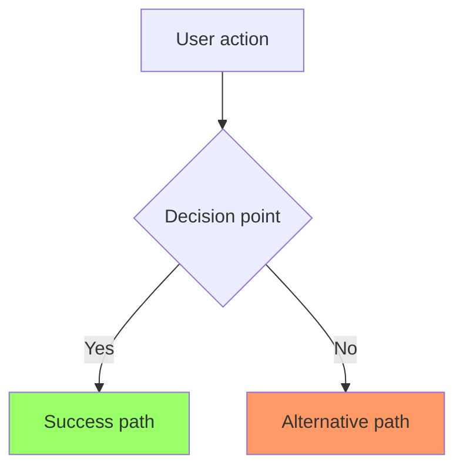
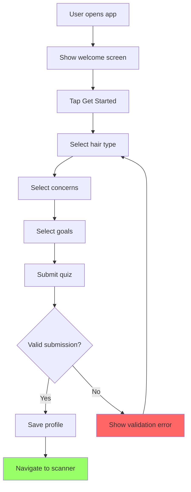

# Create User Story

Create detailed user stories for $ARGUMENTS with BDD acceptance criteria following agile best practices.

## What This Command Creates

Creates comprehensive user stories with:

- User persona and feature statement (As a... I want... So that...)
- Mermaid flow diagram showing the user journey
- Detailed narrative with business rules
- Non-functional requirements (UX-focused, not metrics-based)
- Gherkin acceptance criteria (Given/When/Then)

## Process

### 1. Get Current Date

Retrieves current date for story documentation using a shell command.

### 2. Check for PRD Context

If a PRD exists in `docs/`:

- Read PRD for product context
- Use PRD features to inform story scope
- Align acceptance criteria with PRD goals

### 3. Ask Clarifying Questions

**IMPORTANT**: Only ask questions about genuinely unclear aspects. Do NOT ask about:

- Information already in the PRD or command
- Established patterns from CLAUDE.md
- Information from recent conversation context

**Before writing ANY story:**

- Review story requirements
- Uncover edge cases and missing requirements
- Use lettered questions (a, b, c) with numbered answers (1, 2, 3)
- Wait for user responses before proceeding

### 4. Create User Story

- Create story in appropriate directory
- Follow established agile story format
- Include all required sections

## Story Structure

### File Location

- **Path**: `docs/stories/{STORY-ID}-{short-description}.md`
- **Example**: `docs/stories/HAIR-1-profile-quiz.md`
- **Format**: `{PREFIX}-{NUMBER}` (e.g., HAIR-1, HAIR-2)

### Story Template

````markdown
# User Story: [Feature Title]

**Story ID**: [STORY-ID]
**Created**: [Date]

## User Persona

[Primary user type - e.g., "A user looking for hair care products"]

## Feature Statement

As a [user persona],
I want [feature/capability]
so that [benefit/value].

## Flow Diagram


````

## Narrative

Comprehensive description covering:

- Feature overview and context
- Detailed user flow
- Business rules and logic
- Edge cases and error handling

## Non-functional Requirements

Focus on perceived user experience, not absolute metrics.

### Loading & Feedback

- Does this view need a skeleton loader or can it appear instantly?
- Does this action need a progress indicator or is it instant enough to feel immediate?
- Should the UI block interactions during async operations?

### Accessibility

- Screen reader support, keyboard navigation
- Focus management for modals/dialogs

### Mobile/Responsive

- Mobile-first design considerations
- Touch target sizing

## Acceptance Criteria

### Scenario: [Happy Path Name]

```gherkin
Given [context/precondition]
When [action/event]
Then [expected outcome]
And [additional outcomes]
```

### Scenario: [Error Case Name]

```gherkin
Given [context/precondition]
When [action/event]
Then [expected error handling]
```

## Flow Diagram Best Practices

### Styling Guidelines

- **Error states**: `fill:#f66` (red)
- **Success states**: `fill:#9f6` (green)
- **Special actions**: `fill:#69f` (blue)
- **Warning states**: `fill:#f96` (orange)

### Content Guidelines

- Start with user entry point
- Show all decision branches
- Include error paths and recovery
- Use clear, descriptive labels

## Acceptance Criteria Best Practices

### Comprehensive Coverage

- Happy path scenarios
- Error conditions and edge cases
- Validation rules and constraints
- Different user states
- Boundary conditions

### Writing Style

- Write from user's perspective
- Use specific, testable language
- Include exact UI text and messages
- Specify measurable outcomes

## Example Story

````markdown
# User Story: Hair Profile Quiz

**Story ID**: HAIR-1
**Created**: 2025-01-24

## User Persona

A new user looking for personalized hair care recommendations.

## Feature Statement

As a new user,
I want to complete a hair profile quiz
so that I can get personalized product recommendations based on my hair type.

## Flow Diagram



## Narrative

The hair profile quiz is the first interaction new users have with the app. It collects essential information about the user's hair type, concerns, and goals to enable personalized product recommendations.

The quiz consists of three steps:

1. **Hair Type Selection**: User selects from straight, wavy, curly, or coily
2. **Concerns Selection**: User selects one or more concerns (frizz, dryness, damage, etc.)
3. **Goals Selection**: User selects one or more goals (moisturize, define curls, repair, etc.)

All selections are required. The quiz should feel quick and engaging, with clear visual feedback.

## Non-functional Requirements

### Loading & Feedback

- Quiz steps should load instantly without skeleton loaders (static content)
- Quiz submission requires a progress indicator and should disable the submit button to prevent double-submission
- Navigation between steps should feel immediate

### Accessibility

- All options must be keyboard accessible
- Labels must be readable by screen readers
- Sufficient color contrast for selections
- Focus should move to the first option when navigating to a new step

### Mobile/Responsive

- Touch-friendly selection targets (min 44px)
- Works on screens 320px and up
- Single column layout on mobile

## Acceptance Criteria

### Scenario: New user completes quiz successfully

```gherkin
Given I am a new user on the home page
When I tap "Get Started"
And I select my hair type as "Curly"
And I select my concerns as "Frizz" and "Dryness"
And I select my goals as "Moisturize"
And I submit the quiz
Then I should see the scanner screen
And my profile should be saved
```

### Scenario: User tries to submit without selections

```gherkin
Given I am on the hair type step
When I try to continue without selecting a hair type
Then I should see an error message "Please select your hair type"
And I should remain on the hair type step
```

### Scenario: User navigates back during quiz

```gherkin
Given I am on the goals step
When I tap the back button
Then I should return to the concerns step
And my previous selections should be preserved
```
````

## Example Clarifying Questions

```
a) Should users be able to skip the quiz?
  1) No, quiz is required for personalized recommendations
  2) Yes, with a "Skip for now" option
  3) Yes, but show a reminder later

b) Can users edit their quiz answers later?
  1) Yes, from a settings/profile screen
  2) No, they must complete a new quiz
  3) Yes, but it resets their saved favorites

c) How many concerns/goals can users select?
  1) Exactly one of each
  2) One or more (multi-select)
  3) Up to three of each
```

## After Story Creation

- Story is created but implementation doesn't start automatically
- Use `/plan` command to create implementation plan
- Use `/implement` command to begin development
- Stories serve as reference during development and testing

## Usage Examples

When creating stories, include screenshots from the Lovable prototype to provide visual context for the feature. This helps ensure the implementation matches the design.

```
/story HAIR-1 Hair profile quiz

Implement the multi-step quiz flow where users select their hair type, concerns, and goals.

[Attached: Lovable prototype screenshots showing quiz steps]
```

```
/story HAIR-2 Product scanning with camera

Add the ability to scan product labels using the device camera and display AI analysis results.

[Attached: Lovable prototype screenshots showing scanner screen and results view]
```

```
/story HAIR-3 Save product to favorites

Allow users to save scanned products to a favorites list for future reference.

[Attached: Lovable prototype screenshots showing favorites screen]
```
