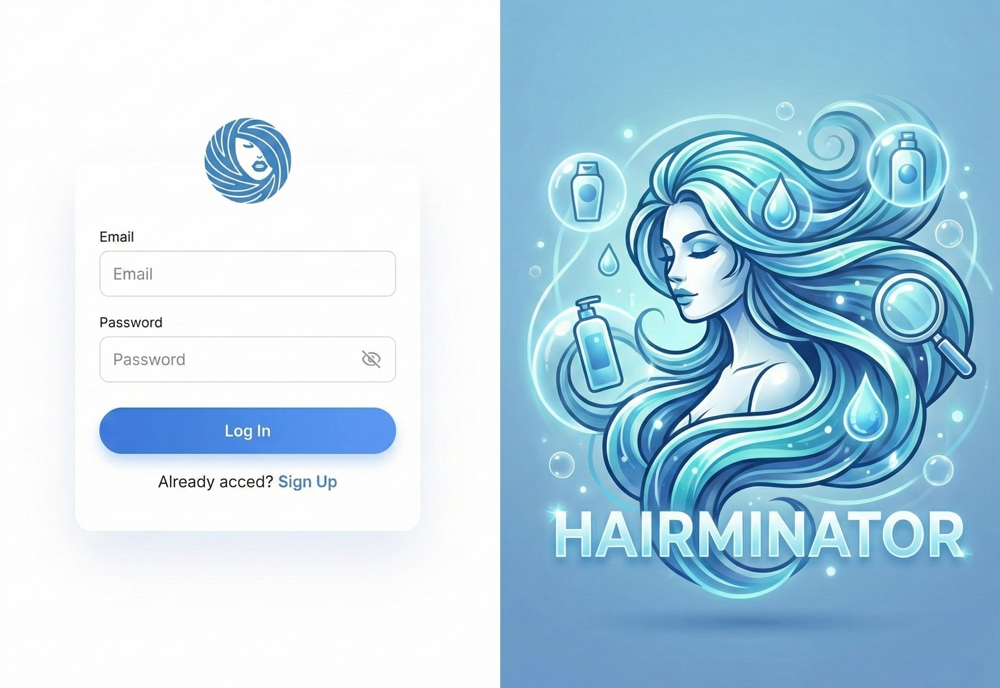

# Implementation Plan: Signup & Login

**Story**: HAIR-3
**Created**: 2025-12-02

## Overview

Implement user authentication with email/password registration and login. Uses NestJS Passport with JWT Bearer tokens for session management. The UI follows the split-screen design from the mockup with the Hairminator illustration on the right side.

**Key Technical Decisions:**

- **Authentication**: Passport.js with JWT strategy (Bearer tokens)
- **Password Hashing**: bcrypt
- **Session Persistence**: JWT stored in localStorage, sent via Authorization header
- **Token Expiry**: Access token with configurable TTL
- **Validation**: Zod only (shared between frontend and backend)

## Visual Reference



The login page uses a split-screen layout:

- **Left side**: Form with Hairminator icon, email/password fields, login button
- **Right side**: `login-illustration.webp` with "HAIRMINATOR" branding
- **Mobile**: Full-screen form with branded header

Assets available:

- `/public/hairminator-icon.svg` - Logo for form header
- `/public/login-illustration.webp` - Right panel illustration

## BDD Scenarios to Implement

```gherkin
Scenario: New user registers successfully
Given I am on the signup page
When I enter "Alex" as my display name
And I enter "alex@example.com" as my email
And I enter "SecurePass1!" as my password
And I enter "SecurePass1!" as password confirmation
And I check the "I accept the Terms and Conditions" checkbox
And I tap "Create Account"
Then I should be redirected to the Dashboard
And I should see "Alex" as my display name in the header

Scenario: User tries to register with existing email
Given an account exists with email "existing@example.com"
And I am on the signup page
When I enter "existing@example.com" as my email
And I fill in all other required fields correctly
And I tap "Create Account"
Then I should see an error "An account with this email already exists"

Scenario: User enters password that doesn't meet requirements
Given I am on the signup page
When I enter "weak" as my password
Then I should see an error "Password must be at least 8 characters with uppercase, number, and special character"

Scenario: User enters mismatched password confirmation
Given I am on the signup page
When I enter "SecurePass1!" as my password
And I enter "DifferentPass1!" as password confirmation
And I tap "Create Account"
Then I should see an error "Passwords do not match"

Scenario: Existing user logs in successfully
Given I have an account with email "alex@example.com" and password "SecurePass1!"
And I am on the login page
When I enter "alex@example.com" as my email
And I enter "SecurePass1!" as my password
And I tap "Log In"
Then I should be redirected to the Dashboard

Scenario: User enters invalid credentials
Given I am on the login page
When I enter "wrong@example.com" as my email
And I enter "wrongpassword" as my password
And I tap "Log In"
Then I should see an error "Invalid email or password"

Scenario: User logs out
Given I am logged in
When I tap my profile icon
And I tap "Log Out"
Then I should be redirected to the login page
And my session should be terminated
```

---

## Phase 1: Presentational UI Components (2025-12-02)

**Subagent**: `frontend-phase-1`
**Testing**: Write tests AFTER implementation

### Tasks

- [x] Create `LoginForm` component (email, password fields, submit button)
- [x] Create `SignupForm` component (display name, email, password, confirm password, terms checkbox)
- [x] Create `AuthLayout` component (split-screen with illustration)
- [x] Create `PasswordInput` component with visibility toggle
- [x] Create `/(auth)/login` page using AuthLayout + LoginForm
- [x] Create `/(auth)/signup` page using AuthLayout + SignupForm
- [x] Create `/(auth)/terms` page with placeholder content
- [x] Style with Tailwind following the mockup (split-screen, modern inputs, branded colors)

### Visual Requirements

Based on the mockup (`docs/stories/HAIR-3/login.jpg`):

- Split-screen: form on left (white/light background), illustration on right
- Hairminator icon centered above form
- Clean input fields with labels above
- Password field with eye icon toggle
- Blue gradient "Log In" / "Create Account" button
- Link to switch between login/signup below button
- Right panel shows `login-illustration.webp` with "HAIRMINATOR" text

### Test Scenarios

After implementation, write tests that verify:

- [x] LoginForm renders email and password fields
- [x] SignupForm renders all required fields including terms checkbox
- [x] PasswordInput toggles visibility when eye icon clicked
- [x] AuthLayout shows illustration on desktop, hides on mobile

### Completion Criteria

- [x] All components created and styled per mockup
- [x] Pages viewable at `/login`, `/signup`, `/terms` (using `(auth)` route group)
- [x] Responsive: split-screen on desktop, single column on mobile
- [x] Tests pass: `pnpm nx test web`

---

## Phase 2: API Client + Mocks (2025-12-02)

**Subagent**: `frontend-phase-2`
**Testing**: Write tests AFTER implementation

### Tasks

- [x] Define auth types in `@hair-product-scanner/shared`:
  - `User` (id, email, displayName, createdAt)
  - `LoginRequest` (email, password)
  - `LoginResponse` (accessToken, user)
  - `SignupRequest` (email, password, displayName?, acceptedTerms)
  - `SignupResponse` (accessToken, user)
- [x] Create Zod schemas for validation `@hair-product-scanner/shared`::
  - `loginSchema` (email, password)
  - `signupSchema` (email, password with complexity, confirmPassword, displayName?, acceptedTerms)
- [x] Create TanStack Query mutations:
  - `useLogin` mutation
  - `useSignup` mutation
  - `useLogout` mutation
  - `useCurrentUser` query
- [x] Set up MSW handlers for `/api/auth/*` endpoints
- [x] Create auth API client functions

### Zod Schema Requirements

Password validation (shared between frontend and backend):

```typescript
const passwordSchema = z
  .string()
  .min(8, 'Password must be at least 8 characters')
  .regex(/[A-Z]/, 'Password must contain an uppercase letter')
  .regex(/[0-9]/, 'Password must contain a number')
  .regex(/[^A-Za-z0-9]/, 'Password must contain a special character');
```

### Test Scenarios

After implementation, write tests that verify:

- [x] Login mutation returns token and user on success
- [x] Login mutation returns error for invalid credentials
- [x] Signup mutation validates password complexity
- [x] Signup mutation validates password confirmation match

### Completion Criteria

- [x] Types defined in shared library
- [x] Zod schemas with password complexity validation
- [x] Query/mutation hooks created
- [x] MSW mocks return realistic responses
- [x] Tests pass: `pnpm nx test web`

---

## Phase 3: Smart Components + State ✅ (2025-12-02)

**Subagent**: `frontend-phase-3`
**Testing**: Write tests AFTER implementation

### Tasks

- [x] Create Zustand auth store (`stores/auth.store.ts`):
  - State: `user`, `accessToken`, `isAuthenticated`
  - Actions: `setAuth`, `clearAuth`
  - Persistence: save/restore token from localStorage
- [x] Add `initializeAuth()` function to restore session on app load
- [x] Connect LoginForm to `useLogin` mutation with React Hook Form
- [x] Connect SignupForm to `useSignup` mutation with React Hook Form
- [x] Add form validation with Zod resolver
- [x] Create `ProtectedRoute` component for authenticated routes
- [x] Add redirect logic (login → dashboard, logout → login)
- [x] Update app header to show user display name and logout button

**Note**: No separate `AuthProvider` component needed - Zustand handles state. Use `initializeAuth()` in root layout to restore session.

### Test Scenarios

After implementation, write integration tests that verify:

- [x] User can complete login flow end-to-end (with mocks)
- [x] User can complete signup flow end-to-end (with mocks)
- [x] Form validation shows inline errors
- [x] Password mismatch shows error on signup
- [x] Terms checkbox required for signup
- [x] Successful login redirects to dashboard
- [x] Logout clears token and redirects to login

### Completion Criteria

- [x] Auth flows work end-to-end with mocked API
- [x] Form validation functional with proper error messages
- [x] Token persisted and restored on refresh
- [x] Protected routes redirect unauthenticated users
- [x] Tests pass: `pnpm nx test web`

---

## Phase 4: Repository Layer (TDD) ✅ (2025-12-02)

**Subagent**: `backend-phase-4`
**Testing**: Write tests FIRST (Testcontainers)

### Tasks

- [x] Write user repository integration tests FIRST
- [x] Create `users` table schema in Drizzle:
  - `id` (uuid, primary key)
  - `email` (varchar, unique)
  - `passwordHash` (varchar)
  - `displayName` (varchar, nullable)
  - `createdAt` (timestamp)
  - `updatedAt` (timestamp)
- [x] Generate and run migration
- [x] Define `UserRepository` interface
- [x] Implement `UserDrizzleRepository`

### Test Scenarios (Write BEFORE Implementation)

```typescript
describe('UserRepository', () => {
  it('should create user and return with generated ID', async () => {
    // Given: valid user data with hashed password
    // When: repository.create(userData)
    // Then: returns user with UUID, email matches, passwordHash stored
  });

  it('should find user by email', async () => {
    // Given: existing user in database
    // When: repository.findByEmail(email)
    // Then: returns the user with all fields
  });

  it('should return null for non-existent email', async () => {
    // Given: email that doesn't exist
    // When: repository.findByEmail(nonExistentEmail)
    // Then: returns null
  });

  it('should find user by ID', async () => {
    // Given: existing user in database
    // When: repository.findById(id)
    // Then: returns the user
  });

  it('should enforce unique email constraint', async () => {
    // Given: existing user with email
    // When: repository.create(sameEmail)
    // Then: throws constraint error
  });
});
```

### Completion Criteria

- [x] Repository tests written and initially failing
- [x] Database migration created and applied
- [x] Repository implementation complete
- [x] All tests pass: `pnpm nx test api`

---

## Phase 5: Service Layer (TDD) ✅ (2025-12-02)

**Subagent**: `backend-phase-5`
**Testing**: Write tests FIRST (Unit tests with mocked repository)

### Tasks

- [x] Write auth service unit tests FIRST
- [x] Define `Authenticator` service interface:
  - `register(data: SignupRequest): Promise<AuthResult>`
  - `login(data: LoginRequest): Promise<AuthResult>`
  - `validateUser(email: string, password: string): Promise<User | null>`
  - `generateToken(user: User): string`
- [x] Implement `AuthenticatorImpl` service:
  - Password hashing with bcrypt
  - Email uniqueness check
  - JWT token generation
- [x] Install and configure dependencies:
  - `bcrypt` for password hashing
  - `@nestjs/jwt` for token generation
  - `@nestjs/passport` and `passport-jwt` for strategy

### Test Scenarios (Write BEFORE Implementation)

```typescript
describe('Authenticator', () => {
  describe('register', () => {
    it('should hash password and create user', async () => {
      // Given: valid signup data, mocked repository
      // When: authenticator.register(data)
      // Then: repository.create called with hashed password (not plain)
      // And: returns { accessToken, user }
    });

    it('should throw CONFLICT for existing email', async () => {
      // Given: repository.findByEmail returns existing user
      // When: authenticator.register(data)
      // Then: throws ValidationException with CONFLICT code
    });

    it('should use display name from email if not provided', async () => {
      // Given: signup without displayName
      // When: authenticator.register(data)
      // Then: user.displayName is email prefix
    });
  });

  describe('login', () => {
    it('should return token for valid credentials', async () => {
      // Given: existing user, correct password
      // When: authenticator.login(data)
      // Then: returns { accessToken, user }
    });

    it('should throw UNAUTHORIZED for wrong password', async () => {
      // Given: existing user, wrong password
      // When: authenticator.login(data)
      // Then: throws ValidationException with UNAUTHORIZED code
    });

    it('should throw UNAUTHORIZED for non-existent email', async () => {
      // Given: email not in database
      // When: authenticator.login(data)
      // Then: throws ValidationException with UNAUTHORIZED code
    });
  });

  describe('validateUser', () => {
    it('should return user for valid credentials', async () => {
      // Given: existing user with known password
      // When: authenticator.validateUser(email, password)
      // Then: returns user object (without passwordHash)
    });

    it('should return null for invalid credentials', async () => {
      // Given: wrong password
      // When: authenticator.validateUser(email, wrongPassword)
      // Then: returns null
    });
  });
});
```

### Completion Criteria

- [x] Service tests written and initially failing
- [x] Service implementation complete with bcrypt + JWT
- [x] All tests pass: `pnpm nx test api`

---

## Phase 6: HTTP Controllers (TDD) ✅ (2025-12-02)

**Subagent**: `backend-phase-6`
**Testing**: Write E2E tests FIRST (Supertest + Testcontainers)

### Tasks

- [x] Create reusable JWT test helpers in `apps/api/src/testing/`
- [x] Write E2E tests FIRST using test helpers
- [x] Create `AuthController` with endpoints:
  - `POST /api/auth/signup` - Register new user
  - `POST /api/auth/login` - Login and get token
  - `POST /api/auth/logout` - Logout (client-side token removal)
  - `GET /api/auth/me` - Get current user (protected)
- [x] Configure Passport JWT strategy
- [x] Create `JwtAuthGuard` for protected routes
- [x] Wire up `AuthModule`

### JWT Strategy Configuration

```typescript
// jwt.strategy.ts
@Injectable()
export class JwtStrategy extends PassportStrategy(Strategy) {
  constructor(configService: ConfigService) {
    super({
      jwtFromRequest: ExtractJwt.fromAuthHeaderAsBearerToken(),
      ignoreExpiration: false,
      secretOrKey: configService.get('JWT_SECRET'),
    });
  }

  async validate(payload: JwtPayload) {
    return { id: payload.sub, email: payload.email };
  }
}
```

### Test Scenarios (Write BEFORE Implementation)

```typescript
describe('AuthController (e2e)', () => {
  describe('POST /api/auth/signup', () => {
    it('should create user and return 201 with token', async () => {
      const response = await request(app.getHttpServer()).post('/api/auth/signup').send({
        email: 'new@example.com',
        password: 'SecurePass1!',
        displayName: 'New User',
        acceptedTerms: true,
      });

      expect(response.status).toBe(201);
      expect(response.body.accessToken).toBeDefined();
      expect(response.body.user.email).toBe('new@example.com');
      expect(response.body.user.displayName).toBe('New User');
      expect(response.body.user.passwordHash).toBeUndefined(); // Never expose
    });

    it('should return 400 for weak password', async () => {
      const response = await request(app.getHttpServer()).post('/api/auth/signup').send({
        email: 'test@example.com',
        password: 'weak',
        acceptedTerms: true,
      });

      expect(response.status).toBe(400);
    });

    it('should return 400 when terms not accepted', async () => {
      const response = await request(app.getHttpServer()).post('/api/auth/signup').send({
        email: 'test@example.com',
        password: 'SecurePass1!',
        acceptedTerms: false,
      });

      expect(response.status).toBe(400);
    });

    it('should return 409 for existing email', async () => {
      // Create user first
      await request(app.getHttpServer()).post('/api/auth/signup').send({
        email: 'existing@example.com',
        password: 'SecurePass1!',
        acceptedTerms: true,
      });

      // Try to create again
      const response = await request(app.getHttpServer()).post('/api/auth/signup').send({
        email: 'existing@example.com',
        password: 'AnotherPass1!',
        acceptedTerms: true,
      });

      expect(response.status).toBe(409);
    });
  });

  describe('POST /api/auth/login', () => {
    it('should return 200 with token for valid credentials', async () => {
      // Create user first
      await request(app.getHttpServer()).post('/api/auth/signup').send({
        email: 'login@example.com',
        password: 'SecurePass1!',
        acceptedTerms: true,
      });

      const response = await request(app.getHttpServer()).post('/api/auth/login').send({
        email: 'login@example.com',
        password: 'SecurePass1!',
      });

      expect(response.status).toBe(200);
      expect(response.body.accessToken).toBeDefined();
      expect(response.body.user.email).toBe('login@example.com');
    });

    it('should return 401 for invalid password', async () => {
      await request(app.getHttpServer()).post('/api/auth/signup').send({
        email: 'user@example.com',
        password: 'SecurePass1!',
        acceptedTerms: true,
      });

      const response = await request(app.getHttpServer()).post('/api/auth/login').send({
        email: 'user@example.com',
        password: 'WrongPassword1!',
      });

      expect(response.status).toBe(401);
      expect(response.body.message).toBe('Invalid email or password');
    });

    it('should return 401 for non-existent email', async () => {
      const response = await request(app.getHttpServer()).post('/api/auth/login').send({
        email: 'nonexistent@example.com',
        password: 'SecurePass1!',
      });

      expect(response.status).toBe(401);
      expect(response.body.message).toBe('Invalid email or password');
    });
  });

  describe('GET /api/auth/me', () => {
    it('should return current user for valid token', async () => {
      // Create and login
      const signupResponse = await request(app.getHttpServer()).post('/api/auth/signup').send({
        email: 'me@example.com',
        password: 'SecurePass1!',
        displayName: 'Test User',
        acceptedTerms: true,
      });

      const token = signupResponse.body.accessToken;

      const response = await request(app.getHttpServer()).get('/api/auth/me').set('Authorization', `Bearer ${token}`);

      expect(response.status).toBe(200);
      expect(response.body.email).toBe('me@example.com');
      expect(response.body.displayName).toBe('Test User');
    });

    it('should return 401 without token', async () => {
      const response = await request(app.getHttpServer()).get('/api/auth/me');

      expect(response.status).toBe(401);
    });

    it('should return 401 for invalid token', async () => {
      const response = await request(app.getHttpServer()).get('/api/auth/me').set('Authorization', 'Bearer invalid-token');

      expect(response.status).toBe(401);
    });
  });
});
```

### Completion Criteria

- [x] E2E tests written and initially failing
- [x] Controller implementation complete
- [x] JWT strategy configured
- [x] All tests pass: `pnpm nx test api`
- [x] Manual verification with cURL

---

## Phase 7: Frontend-Backend Integration

**Subagent**: `integration-phase-7`
**Testing**: Manual testing of complete flow

### Tasks

- [ ] Update API client to point to real backend endpoints
- [ ] Configure MSW to only run in test environment
- [ ] Test complete signup flow
- [ ] Test complete login flow
- [ ] Test session persistence (refresh page)
- [ ] Test logout flow
- [ ] Test protected route redirection
- [ ] Fix any integration issues

### Verification Checklist

Manually verify each BDD scenario:

- [ ] **New user registers successfully**: Signup → Dashboard with display name
- [ ] **Register with existing email**: Shows "account exists" error
- [ ] **Weak password**: Shows complexity requirements error
- [ ] **Password mismatch**: Shows "passwords do not match" error
- [ ] **Terms not accepted**: Shows "must accept terms" error
- [ ] **Successful login**: Login → Dashboard
- [ ] **Invalid credentials**: Shows "Invalid email or password"
- [ ] **Session persistence**: Refresh page → still logged in
- [ ] **Logout**: Clears session → redirects to login
- [ ] **Protected route**: Unauthenticated → redirects to login

### Completion Criteria

- [ ] Frontend connected to real backend
- [ ] All BDD scenarios verified manually
- [ ] No console errors
- [ ] `pnpm check-all` passes
- [ ] Ready for PR

---

## Testing Infrastructure

### Reusable JWT Test Helpers

Create helpers in `apps/api/src/testing/` for E2E tests:

```typescript
// apps/api/src/testing/jwt.helpers.ts
import { JwtService } from '@nestjs/jwt';

const TEST_JWT_SECRET = 'test-jwt-secret-key-for-e2e-tests-min-32-chars';

/**
 * Generate a signed JWT for testing without calling auth endpoints.
 * Use this for non-auth controller tests to avoid coupling to auth implementation.
 */
export function generateTestJwt(userId: string, email = 'test@example.com'): string {
  const jwtService = new JwtService({ secret: TEST_JWT_SECRET });
  return jwtService.sign({ sub: userId, email }, { expiresIn: '1h' });
}

/**
 * Insert a test user directly into the database.
 * Use with generateTestJwt() for fast, isolated tests.
 */
export async function insertTestUser(db: DrizzleDB, data: { id?: string; email: string; displayName?: string }): Promise<{ id: string; email: string }> {
  const id = data.id ?? crypto.randomUUID();
  await db.insert(users).values({
    id,
    email: data.email,
    displayName: data.displayName,
    passwordHash: 'not-used-in-jwt-tests',
  });
  return { id, email: data.email };
}
```

### API Test Setup

Create `apps/api/vitest.setup.ts` to configure test environment:

```typescript
// apps/api/vitest.setup.ts
import { beforeAll } from 'vitest';

beforeAll(() => {
  // Set JWT secret for all tests
  process.env.JWT_SECRET = 'test-jwt-secret-key-for-e2e-tests-min-32-chars';
});
```

Update `apps/api/vitest.config.ts`:

```typescript
export default defineConfig(() => ({
  // ... existing config
  test: {
    // ... existing test config
    setupFiles: ['./vitest.setup.ts'],
  },
}));
```

### Test Strategy by Test Type

| Test Type           | Auth Approach                            | When to Use                        |
| ------------------- | ---------------------------------------- | ---------------------------------- |
| **Auth E2E tests**  | Call real signup/login endpoints         | Testing the auth flow itself       |
| **Other E2E tests** | `insertTestUser()` + `generateTestJwt()` | Non-auth controllers needing auth  |
| **Unit tests**      | Mock the guard/decorator                 | Testing service logic in isolation |

**Why this approach?**

- Auth E2E tests validate the full auth flow works
- Other tests don't depend on auth implementation - if auth breaks, only auth tests fail
- Fast: no HTTP calls or bcrypt hashing for non-auth tests
- Isolated: tests don't affect each other

---

## Dependencies to Install

### Backend (apps/api)

```bash
pnpm add @nestjs/passport @nestjs/jwt passport passport-jwt bcrypt
pnpm add -D @types/passport-jwt @types/bcrypt
```

### Environment Variables

```env
JWT_SECRET=your-secret-key-min-32-chars
JWT_EXPIRES_IN=7d
```

---

## File Structure After Implementation

```
apps/api/src/
├── app/
│   ├── auth/
│   │   ├── auth.module.ts
│   │   ├── auth.controller.ts
│   │   ├── auth.controller.e2e.spec.ts
│   │   ├── authenticator.service.ts
│   │   ├── authenticator.service-impl.ts
│   │   ├── authenticator.service.spec.ts
│   │   ├── user.repository.ts
│   │   ├── user.drizzle-repository.ts
│   │   ├── user.repository.spec.ts
│   │   ├── jwt.strategy.ts
│   │   └── jwt-auth.guard.ts
│   └── app.module.ts
├── database/
│   ├── schema/
│   │   ├── users.ts          # NEW
│   │   └── index.ts
│   └── migrations/
├── testing/                   # NEW - Reusable test helpers
│   ├── jwt.helpers.ts
│   └── index.ts
└── vitest.setup.ts            # NEW - Test environment setup

apps/web/
├── app/
│   └── (auth)/
│       ├── login/
│       │   └── page.tsx
│       ├── signup/
│       │   └── page.tsx
│       └── terms/
│           └── page.tsx
├── components/
│   └── auth/
│       ├── LoginForm.tsx
│       ├── SignupForm.tsx
│       ├── AuthLayout.tsx
│       └── PasswordInput.tsx
├── hooks/
│   └── useAuth.ts
├── stores/
│   └── auth.store.ts          # Zustand store (no AuthProvider needed)
└── lib/
    └── api/
        └── auth.ts

libs/shared/src/
├── types/
│   ├── auth.types.ts         # NEW
│   └── index.ts
└── schemas/
    ├── auth.schemas.ts       # NEW
    └── index.ts
```
