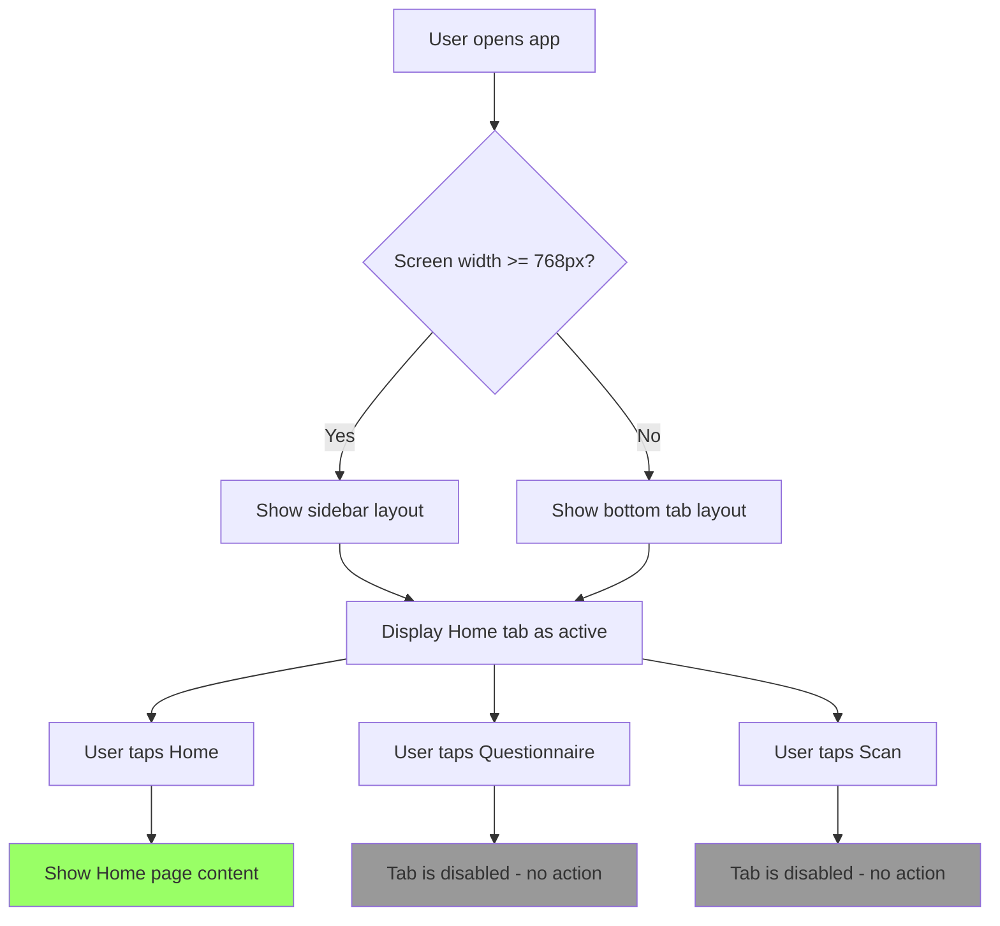

# User Story: Mobile-First App Layout with Responsive Navigation

**Story ID**: HAIR-1
**Created**: 2025-11-30

## User Persona

A user accessing the Hairminator app on various devices (mobile phone, tablet, desktop).

## Feature Statement

As a user,
I want a responsive app layout with bottom navigation on mobile and sidebar navigation on larger screens
so that I can easily navigate between app features regardless of my device.

## Flow Diagram



## Narrative

This story establishes the foundational navigation structure for Hairminator. The app uses a mobile-first approach with responsive navigation that adapts to screen size:

**Mobile Layout (< 768px)**

- Bottom tab bar fixed at the bottom of the viewport
- Three tabs: Home, Questionnaire, Scan
- Home tab is active and navigable
- Questionnaire and Scan tabs appear disabled (grayed out, not clickable)
- Main content area fills remaining viewport height

**Desktop/Tablet Layout (>= 768px)**

- Sidebar navigation on the left side
- Same three navigation items: Home, Questionnaire, Scan
- Home is active and navigable
- Questionnaire and Scan items appear disabled
- Main content area fills remaining width

**Navigation Items (P0)**

| Item          | Icon                   | Route            | Status   |
| ------------- | ---------------------- | ---------------- | -------- |
| Home          | Home (Lucide)          | `/`              | Active   |
| Questionnaire | ClipboardList (Lucide) | `/questionnaire` | Disabled |
| Scan          | Camera (Lucide)        | `/scan`          | Disabled |

**Home Page Content**
For this story, the Home page displays only placeholder content indicating where scan history will appear. The actual scan history functionality will be implemented in a future story.

## Non-functional Requirements

### Loading & Feedback

- Layout shell should render instantly (static structure)
- No skeleton loaders needed for navigation
- Active tab should have clear visual indicator

### Accessibility

- Navigation items must be keyboard accessible
- Disabled items should be focusable but not activatable
- Screen readers should announce disabled state
- Proper landmark roles (`nav`, `main`)
- Focus visible indicator on all interactive elements

### Mobile/Responsive

- Bottom tabs must have minimum 44px touch targets
- Safe area insets respected on notched devices
- Layout works on screens 320px and up
- Smooth transition not required when resizing (can snap)

## Acceptance Criteria

### Scenario: User views app on mobile device

```gherkin
Given I am viewing the app on a device with screen width less than 768px
When the page loads
Then I should see a bottom navigation bar with 3 tabs
And the tabs should be "Home", "Questionnaire", and "Scan"
And each tab should display an icon and label
And the "Home" tab should appear selected/active
And the "Questionnaire" and "Scan" tabs should appear grayed out
```

### Scenario: User views app on desktop/tablet

```gherkin
Given I am viewing the app on a device with screen width 768px or greater
When the page loads
Then I should see a sidebar navigation on the left
And the sidebar should contain "Home", "Questionnaire", and "Scan" items
And each item should display an icon and label
And the "Home" item should appear selected/active
And the "Questionnaire" and "Scan" items should appear grayed out
```

### Scenario: User taps Home tab on mobile

```gherkin
Given I am on the mobile layout
When I tap the "Home" tab
Then I should see the Home page content
And the "Home" tab should be highlighted as active
```

### Scenario: User attempts to tap disabled tab on mobile

```gherkin
Given I am on the mobile layout
When I tap the "Questionnaire" tab
Then nothing should happen
And I should remain on the current page
And the "Questionnaire" tab should remain grayed out
```

### Scenario: User attempts to tap disabled tab on desktop

```gherkin
Given I am on the desktop layout
When I click the "Scan" sidebar item
Then nothing should happen
And I should remain on the current page
And the "Scan" item should remain grayed out
```

### Scenario: User navigates with keyboard

```gherkin
Given I am using keyboard navigation
When I tab through the navigation items
Then I should be able to focus on all navigation items including disabled ones
And pressing Enter on "Home" should navigate to the Home page
And pressing Enter on "Questionnaire" or "Scan" should do nothing
And screen reader should announce "Questionnaire, disabled" for disabled items
```

### Scenario: Home page displays placeholder content

```gherkin
Given I am on the Home page
When the page loads
Then I should see a placeholder indicating scan history will appear here
And the placeholder should include text like "Your scan history will appear here"
```

### Scenario: Layout adapts when window is resized

```gherkin
Given I am viewing the app on a resizable window
When I resize the window from above 768px to below 768px
Then the sidebar should be replaced with bottom tabs
And the "Home" item should remain active
```

## Out of Scope

- Actual scan history content and functionality
- Questionnaire page content
- Scan page content
- User authentication
- Animations/transitions between layouts
- Collapsible sidebar
