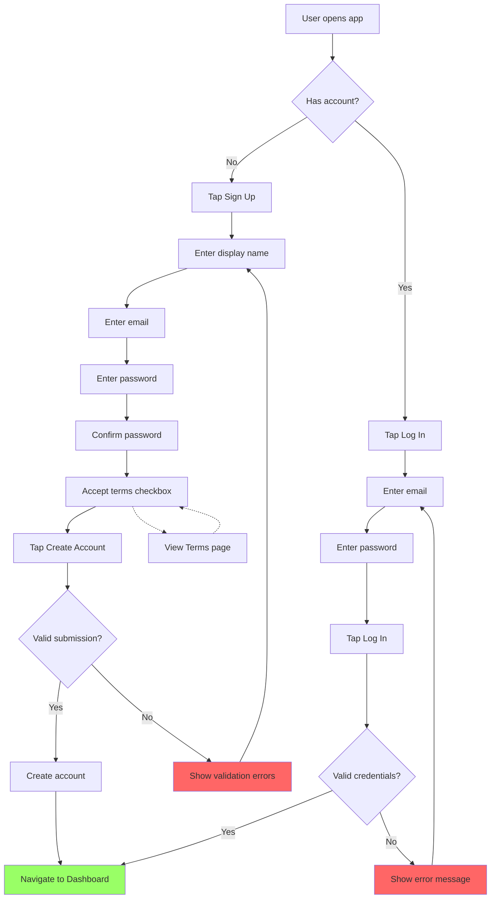

# User Story: Signup & Login

**Story ID**: HAIR-3
**Created**: 2025-12-02

## User Persona

A new user who wants to use Hairminator to get personalized hair product recommendations.

## Feature Statement

As a new user,
I want to create an account and log in securely
so that my hair profile and scan history are saved and accessible across sessions.

## Flow Diagram



## Narrative

User authentication is the foundation of Hairminator's personalized experience. Users must create an account to save their hair profile and scan history, enabling consistent recommendations across sessions and devices.

### Registration Flow

New users create an account by providing:

1. **Display Name**: How they want to be addressed in the app (optional field, but encouraged)
2. **Email Address**: Used as the unique identifier and for future communications
3. **Password**: Must be at least 8 characters with complexity requirements (uppercase, number, special character)
4. **Password Confirmation**: Must match the password
5. **Terms Acceptance**: Checkbox with link to Terms & Conditions page

The Terms & Conditions page is a placeholder for now - it will display a simple message indicating terms will be added later. The link opens in a new page so users don't lose their registration progress.

### Login Flow

Returning users log in with their email and password. Invalid credentials show a generic error message ("Invalid email or password") to prevent email enumeration attacks.

### Session Management

After successful login or registration, users are redirected to the Dashboard. Sessions persist across browser restarts until the user explicitly logs out.

### Future Considerations (Out of Scope)

The following features are planned for future iterations but are NOT part of this story:

- **Social Authentication**: Google, Apple, Facebook login
- **Email Confirmation**: Magic link for signup verification
- **Two-Factor Authentication**: SMS and authenticator app support
- **Password Reset**: Forgot password flow

## Non-functional Requirements

### Visual Design

The login and signup pages should feel modern, polished, and distinctive - not like a generic Bootstrap form. Key visual requirements:

**Layout**

- Split-screen layout on desktop: form on one side, branded visual/illustration on the other
- Full-screen form with branded header on mobile
- Generous whitespace and breathing room around form elements

**Branding & Personality**

- Incorporate Hairminator brand colors and typography
- Consider a subtle hair-related illustration or abstract graphic element
- The pages should feel welcoming and professional, reflecting a beauty/hair care product

**Form Styling**

- Modern input fields with floating labels or clean outlined style
- Smooth focus states and transitions
- Password visibility toggle icon
- Subtle shadows or glassmorphism effects where appropriate

**Micro-interactions**

- Button hover/active states with smooth transitions
- Form field focus animations
- Loading spinner integrated into the submit button during submission

### Loading & Feedback

- Form submission should show a loading state on the button to prevent double-submission
- Validation errors should appear inline next to the relevant field
- Success should feel immediate - redirect happens as soon as account is created

### Accessibility

- All form fields must have proper labels for screen readers
- Error messages must be announced to screen readers
- Focus should move to the first error field when validation fails
- Terms link must be keyboard accessible

### Mobile/Responsive

- Forms should be single-column on all screen sizes
- Touch-friendly input fields and buttons (min 44px touch targets)
- Keyboard should not obscure active input field on mobile

### Security

- Passwords must never be logged or exposed in error messages
- Use secure HTTP-only cookies for session management
- Rate limit login attempts to prevent brute force attacks

## Acceptance Criteria

### Scenario: New user registers successfully

```gherkin
Given I am on the signup page
When I enter "Alex" as my display name
And I enter "alex@example.com" as my email
And I enter "SecurePass1!" as my password
And I enter "SecurePass1!" as password confirmation
And I check the "I accept the Terms and Conditions" checkbox
And I tap "Create Account"
Then I should be redirected to the Dashboard
And I should see "Alex" as my display name in the header
```

### Scenario: New user registers without display name

```gherkin
Given I am on the signup page
When I leave the display name field empty
And I enter valid email, password, and confirmation
And I accept the terms
And I tap "Create Account"
Then I should be redirected to the Dashboard
And I should see my email as identifier in the header
```

### Scenario: User tries to register with existing email

```gherkin
Given an account exists with email "existing@example.com"
And I am on the signup page
When I enter "existing@example.com" as my email
And I fill in all other required fields correctly
And I tap "Create Account"
Then I should see an error "An account with this email already exists"
And I should remain on the signup page
```

### Scenario: User enters password that doesn't meet requirements

```gherkin
Given I am on the signup page
When I enter "weak" as my password
Then I should see an error "Password must be at least 8 characters with uppercase, number, and special character"
```

### Scenario: User enters mismatched password confirmation

```gherkin
Given I am on the signup page
When I enter "SecurePass1!" as my password
And I enter "DifferentPass1!" as password confirmation
And I tap "Create Account"
Then I should see an error "Passwords do not match"
```

### Scenario: User tries to register without accepting terms

```gherkin
Given I am on the signup page
When I fill in all fields correctly
But I do not check the terms acceptance checkbox
And I tap "Create Account"
Then I should see an error "You must accept the Terms and Conditions"
And I should remain on the signup page
```

### Scenario: User views Terms and Conditions

```gherkin
Given I am on the signup page
When I tap the "Terms and Conditions" link
Then I should navigate to the Terms and Conditions page
And I should see a placeholder message about terms being added soon
```

### Scenario: Existing user logs in successfully

```gherkin
Given I have an account with email "alex@example.com" and password "SecurePass1!"
And I am on the login page
When I enter "alex@example.com" as my email
And I enter "SecurePass1!" as my password
And I tap "Log In"
Then I should be redirected to the Dashboard
```

### Scenario: User enters invalid credentials

```gherkin
Given I am on the login page
When I enter "wrong@example.com" as my email
And I enter "wrongpassword" as my password
And I tap "Log In"
Then I should see an error "Invalid email or password"
And I should remain on the login page
```

### Scenario: User navigates between login and signup

```gherkin
Given I am on the login page
When I tap "Don't have an account? Sign up"
Then I should navigate to the signup page

Given I am on the signup page
When I tap "Already have an account? Log in"
Then I should navigate to the login page
```

### Scenario: Session persists across browser restarts

```gherkin
Given I am logged in as "alex@example.com"
When I close and reopen the browser
And I navigate to the app
Then I should still be logged in
And I should see the Dashboard
```

### Scenario: User logs out

```gherkin
Given I am logged in
When I tap my profile icon
And I tap "Log Out"
Then I should be redirected to the login page
And my session should be terminated
```
