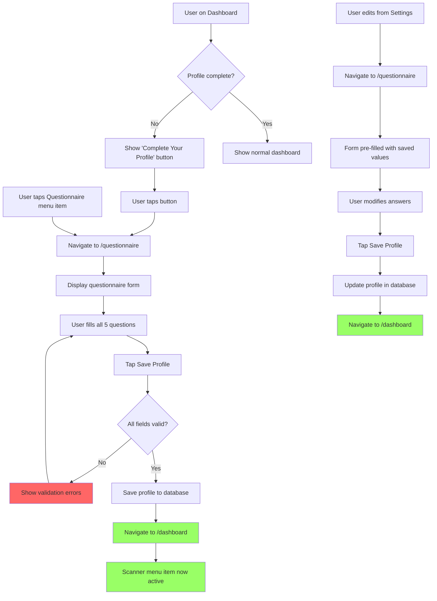

# User Story: Dermo-Safety Questionnaire

**Story ID**: HAIR-5
**Created**: 2025-12-05

## User Persona

A user with scalp conditions (seborrheic dermatitis, psoriasis, eczema, dandruff, or sensitivity) who needs personalized product safety recommendations.

## Feature Statement

As a registered user,
I want to complete a dermo-safety questionnaire about my scalp and hair conditions
so that the app can provide personalized ingredient compatibility assessments when I scan products.

## Flow Diagram



## Narrative

The dermo-safety questionnaire is a critical step in the Hairminator user journey. It collects essential information about the user's scalp condition, symptoms, and hair characteristics to enable personalized ingredient safety analysis when scanning products.

### Questionnaire Access

After signup, users land on the Dashboard. The questionnaire menu item is active in the navigation, but the Scanner menu item remains disabled until the questionnaire is complete. The Dashboard displays a prominent "Complete Your Profile" button when no profile exists.

Users can also access the questionnaire directly via the navigation menu at any time.

### Question Structure

The questionnaire consists of 5 required questions presented in a single scrollable form:

**1. Scalp Condition** (single select, required)

- Seborrheic Dermatitis
- Psoriasis
- Atopic Dermatitis (Eczema)
- Severe Dandruff
- Just Sensitive/Itchy

**2. Sebum Level** (single select, required)

- Excessive Sebum
- Moderate/Normal
- Dry/Tight Skin

**3. Active Symptoms** (multi-select, at least 1 required)

- Itching
- Redness/Inflammation
- Yellow/Greasy Scales
- White/Dry Flakes
- Pain/Burning

**4. Hair Strand Condition** (single select, required)

- Natural/Virgin
- Dyed/Color-Treated
- Bleached/High Porosity

**5. Ingredient Tolerance** (single select, required)

- Resilient
- Moderate
- Hypoallergenic

### Form Behavior

All questions are displayed on a single scrollable page. The form validates that all required fields are completed before submission. For multi-select questions (Active Symptoms), at least one option must be selected.

The "Save Profile" button submits the form. On successful save, the user is redirected to the Dashboard and the Scanner menu item becomes active.

### Editing Profile

Users can edit their profile from Settings. The questionnaire form loads with their saved values pre-filled. They can modify any answers and tap "Save Profile" to update their profile. The form works identically to the initial creation flow, just updating instead of creating.

### Navigation Gating

- **Questionnaire menu item**: Always active for logged-in users
- **Scanner menu item**: Disabled until questionnaire is complete (no tooltip or message needed)
- **Dashboard**: Shows "Complete Your Profile" CTA when profile is incomplete

## Non-functional Requirements

### Loading & Feedback

- Form content is static and should render instantly without skeleton loaders
- Save button should show loading state during submission and be disabled to prevent double-submission
- Validation errors should appear inline next to the relevant question
- After successful save, redirect to dashboard should feel immediate

### Accessibility

- All form fields must have proper labels for screen readers
- Radio buttons and checkboxes must be keyboard navigable
- Error messages must be announced to screen readers
- Focus should move to the first error when validation fails
- Multi-select checkboxes should indicate selection state to screen readers

### Mobile/Responsive

- Single column layout on all screen sizes
- Touch-friendly selection targets (min 44px)
- Form should not require horizontal scrolling on any device
- Questions should have clear visual separation

### Visual Design

- Questions should be visually distinct with clear numbering or section breaks
- Selected options should have obvious visual feedback
- The form should feel approachable and not clinical despite medical terminology
- Consider brief helper text for medical terms (e.g., "Atopic Dermatitis (Eczema)")

## Acceptance Criteria

### Scenario: New user sees profile prompt on dashboard

```gherkin
Given I am a logged-in user without a dermo-safety profile
When I navigate to the Dashboard
Then I should see a "Complete Your Profile" button
And the Scanner menu item should be disabled
And the Questionnaire menu item should be enabled
```

### Scenario: User accesses questionnaire from dashboard prompt

```gherkin
Given I am on the Dashboard without a completed profile
When I tap "Complete Your Profile"
Then I should navigate to the questionnaire page
And I should see all 5 questions displayed on a single page
```

### Scenario: User accesses questionnaire from navigation menu

```gherkin
Given I am a logged-in user
When I tap the Questionnaire menu item
Then I should navigate to the questionnaire page
```

### Scenario: User completes questionnaire successfully

```gherkin
Given I am on the questionnaire page
When I select "Seborrheic Dermatitis" for scalp condition
And I select "Excessive Sebum" for sebum level
And I select "Itching" and "Yellow/Greasy Scales" for active symptoms
And I select "Natural/Virgin" for hair strand condition
And I select "Moderate" for ingredient tolerance
And I tap "Save Profile"
Then my profile should be saved
And I should be redirected to the Dashboard
And the Scanner menu item should now be enabled
```

### Scenario: User tries to submit without completing all fields

```gherkin
Given I am on the questionnaire page
When I select options for only 3 of the 5 questions
And I tap "Save Profile"
Then I should see validation errors for the incomplete questions
And I should remain on the questionnaire page
```

### Scenario: User tries to submit without selecting any symptoms

```gherkin
Given I am on the questionnaire page
When I complete all questions except Active Symptoms
And I tap "Save Profile"
Then I should see an error "Please select at least one symptom"
And I should remain on the questionnaire page
```

### Scenario: User edits existing profile from settings

```gherkin
Given I have a completed dermo-safety profile
And my scalp condition is set to "Psoriasis"
When I navigate to edit my profile from Settings
Then I should see the questionnaire form
And "Psoriasis" should be pre-selected for scalp condition
And all my other saved values should be pre-selected
```

### Scenario: User updates their profile

```gherkin
Given I am editing my existing profile
And my scalp condition is "Psoriasis"
When I change my scalp condition to "Severe Dandruff"
And I tap "Save Profile"
Then my profile should be updated with the new value
And I should be redirected to the Dashboard
```

### Scenario: Scanner is blocked without profile

```gherkin
Given I am a logged-in user without a dermo-safety profile
When I view the navigation menu
Then the Scanner menu item should be disabled
And I should not be able to navigate to the scanner
```

### Scenario: Scanner is enabled after profile completion

```gherkin
Given I have just completed the dermo-safety questionnaire
When I view the navigation menu
Then the Scanner menu item should be enabled
And I should be able to navigate to the scanner
```

### Scenario: Dashboard updates after profile completion

```gherkin
Given I have just completed the dermo-safety questionnaire
When I arrive at the Dashboard
Then I should not see the "Complete Your Profile" button
And I should see the normal dashboard content
```
